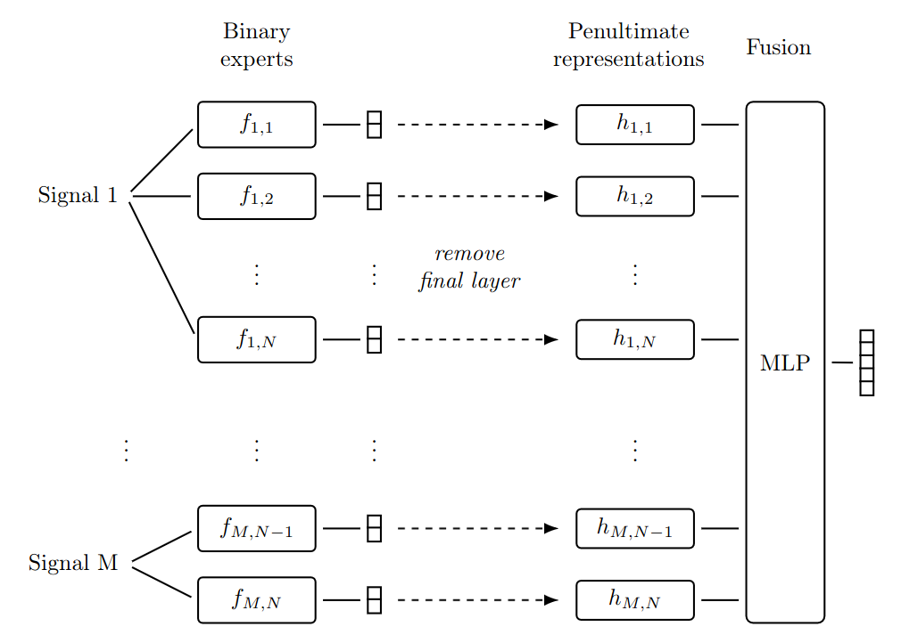
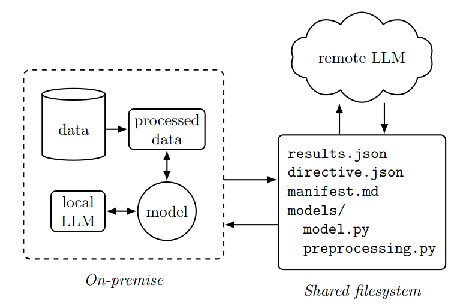
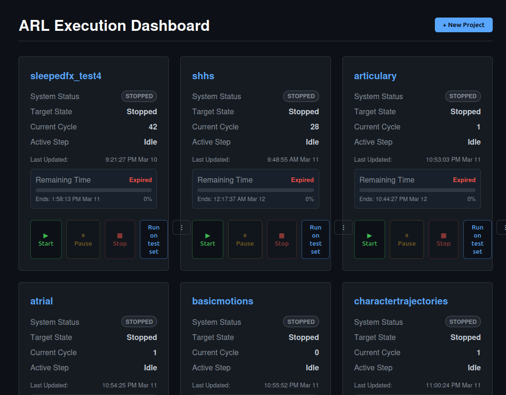

# ELD-NAS: Ensemble-based, LLM-guided, Data-Local NAS

ELD-NAS (Ensemble-based, LLM-guided, Data-Local NAS) is a data-local experimentation framework for multiclass, multimodal time-series classification.

Technically, ELD-NAS runs a closed loop:
- It decomposes the multiclass task into one-vs-rest binary experts per modality and class.
- It fuses expert embeddings with a lightweight MLP ensemble.
- An LLM controller proposes architecture/preprocessing changes per cycle.
- Training and evaluation always run locally, while the LLM only sees aggregate metrics and artifacts.

This framework is:
- `Data-local by design`: no raw samples are sent to the remote LLM.
- `Cycle-based automation`: proposal -> train -> evaluate -> log -> next proposal.
- `Auditable artifacts`: each cycle writes structured manifests, directives, and results.

Model overview (paper Figure 1):



System overview (paper Figure 2):



## Paper

This repository implements the system described in:

Emil Hardarson, Luka Biedebach, Omar Bessi Omarsson, Teitur Hrolfsson, Anna Sigridur Islind, Maria Oskarsdottir.
"Data-Local Autonomous LLM-Guided Neural Architecture Search for Multiclass Multimodal Time-Series Classification."
arXiv:2603.15939, 2026.

Link: https://arxiv.org/abs/2603.15939


## Results from the paper

Full benchmark summary from Table 1 (test accuracy, %):

These numbers were obtained using these settings:

The framework uses a remote LLM controller through an OpenAI-compatible Responses API endpoint.

- API URL: `ARL_LLM_API_URL` (default in code: `https://api.openai.com/v1/responses`)
- Model: `ARL_LLM_MODEL`
- Key: `ARL_LLM_API_KEY`

Important:
- The framework does not hardcode one single model; you choose it via environment variables.

Reported settings used for the results listed below:

```bash
ARL_LLM_MODEL=gpt-5
ARL_LLM_TEMPERATURE=0.2
ARL_REASONING_EFFORT=low
ARL_OLLAMA_REPAIR_MAX_ATTEMPTS=6
ARL_OLLAMA_CONTAINER=auto_research_lab-ollama-1
ARL_OLLAMA_MODEL=qwen3.5:9b
ARL_OLLAMA_REPAIR_TIMEOUT_SECONDS=600
```

| Dataset | Baseline (end-to-end) | Baseline (staged) | LLM-NAS | Notes |
|---|---:|---:|---:|---|
| SleepEDFx (SEDF) | 82.9 | 84.7 | 87.9 | 30-cycle NAS |
| ArticularyWordRecognition (AWR) | 91.7 | 96.3 | - | NAS skipped (validation reached 100%) |
| AtrialFibrillation (AF) | 33.3 | 33.3 | - | Not evaluated |
| BasicMotions (BM) | 100.0 | 92.5 | - | NAS skipped (validation reached 100%) |
| CharacterTrajectories (CT) | 90.1 | 95.8 | 95.8 | 10-cycle NAS |
| Cricket (CR) | 95.8 | 93.1 | - | NAS skipped (validation reached 100%) |
| ERing (ER) | 90.7 | 85.2 | 80.1 | 10-cycle NAS |
| EigenWorms (EW) | 75.6 | 77.8 | 84.0 | 10-cycle NAS |
| Epilepsy (EP) | 96.4 | 97.1 | - | NAS skipped (validation reached 100%) |
| EthanolConcentration (EC) | 28.1 | 32.7 | 44.1 | 60-cycle NAS |
| HandMovementDirection (HMD) | 40.5 | 20.3 | 21.6 | 10-cycle NAS |
| Handwriting (HW) | 13.1 | 14.0 | 14.0 | 10-cycle NAS |
| JapaneseVowels (JV) | 96.5 | 97.0 | 94.9 | 10-cycle NAS |
| Libras (LIB) | 60.6 | 76.7 | 78.9 | 10-cycle NAS |
| LSST | 49.1 | 66.5 | 66.5 | 10-cycle NAS |
| NATOPS (NAT) | 88.9 | 84.7 | 90.1 | 10-cycle NAS |
| PenDigits (PD) | 96.2 | 95.7 | 95.7 | 10-cycle NAS |
| PhonemeSpectra (PS) | 23.6 | 26.2 | 26.2 | 10-cycle NAS |
| RacketSports (RS) | 79.6 | 75.7 | 73.0 | 10-cycle NAS |
| SpokenArabicDigits (SAD) | 95.2 | 98.5 | 98.5 | 10-cycle NAS |
| StandWalkJump (SWJ) | 33.3 | 33.3 | - | Not evaluated |
| UWaveGestureLibrary (UWG) | 49.7 | 83.1 | 83.1 | 10-cycle NAS |

Notes:
- `-` means the paper reports NAS as not evaluated or skipped.
- SleepEDFx uses a 30-cycle NAS run, and EthanolConcentration uses a 60-cycle NAS run.

Paper-wide takeaways:
- Staged expert + fusion baseline is already strong.
- LLM-guided NAS gives the largest gains when baseline architecture is a weaker fit.
- SleepEDFx and EthanolConcentration are the clearest improvement cases.

## Interface

The web UI is a control panel for project lifecycle and cycle monitoring.

- Create a project from a dataset path.
- Start, pause, or stop runs.
- Track cycle status, execution logs, and model history.
- Inspect generated artifacts and run test-set evaluation.



## Data structure required

Dataset root must contain three splits:

```text
<dataset_root>/
	train/
		y.npy
		X_<signal_name_1>.npy
		X_<signal_name_2>.npy
		...
	validate/
		y.npy
		X_<signal_name_1>.npy
		X_<signal_name_2>.npy
		...
	test/
		y.npy
		X_<signal_name_1>.npy
		X_<signal_name_2>.npy
		...
```

Data expectations:
- One `y.npy` per split with class labels.
- One or more modality/signal files named `X_*.npy` per split.
- First axis is sample axis (`N`) and should align with `y.npy` length.

## Repo structure

- `app.py`: Flask UI and API.
- `main.py`: CLI orchestration (`init`, `run`) and cycle loop.
- `local/scripts/`: local training/evaluation engine.
- `remote/scripts/`: director/proposer LLM scripts.
- `schemas/`: directive/results/model metadata schemas.

## Setup

Use Python 3.10+.

```bash
python -m venv .venv
source .venv/bin/activate
pip install flask sqlalchemy numpy scipy pyyaml torch scikit-learn python-dotenv jsonschema matplotlib
```

Set LLM environment variables:

```bash
export ARL_LLM_API_KEY="..."
export ARL_LLM_MODEL="gpt-5-2025-08-07"
export ARL_LLM_API_URL="https://api.openai.com/v1/responses"
```

## Quick start

```bash
python app.py
```

Open `http://localhost:5000`, create a project, and start the run.

Equivalent CLI:

```bash
python main.py init <project_name> <dataset_path>
python main.py run <project_name>
```

## Outputs

Generated project artifacts are written to:

- `projects/<project_name>/artifacts/expert_matrix.json`
- `projects/<project_name>/artifacts/cycle_history/`
- `projects/<project_name>/shared/outbound/results.json`
- `projects/<project_name>/shared/context/manifests/`
